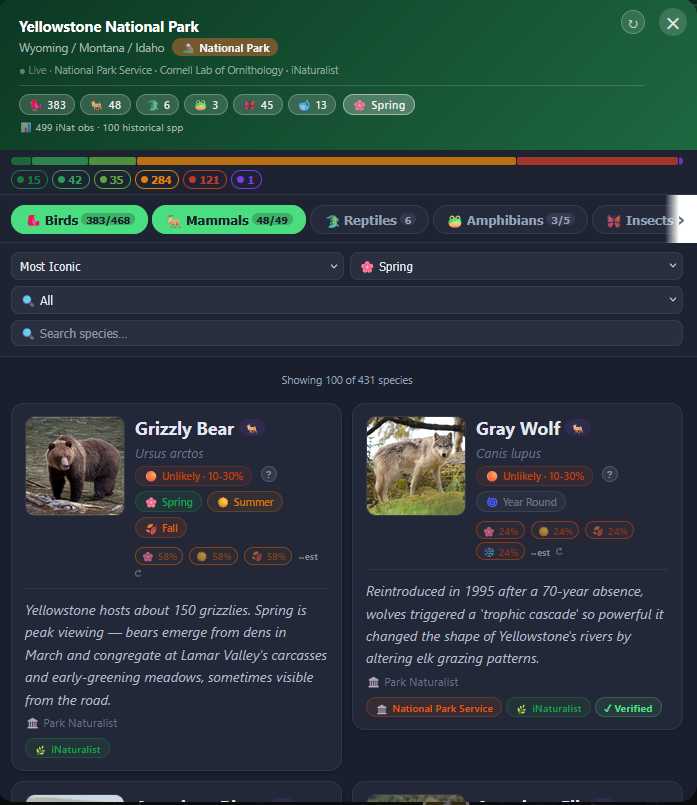

# 🦅 Wildlife Explorer

**Interactive map of all 63 US National Parks with 32,000+ wildlife species, probability-based rarity ratings, and seasonal migration data.**

🌐 **[wildlife-explorer-theta.vercel.app](https://wildlife-explorer-theta.vercel.app)**

---

## Screenshot



---

## Features

- **63 US National Parks** — every NPS-designated national park, from Acadia to Wrangell–St. Elias
- **32,000+ species entries** — mammals, birds, reptiles, amphibians, insects, and marine life, pre-loaded from eBird, iNaturalist, NPS, and GBIF
- **6-tier probability rarity system** — Guaranteed → Very Likely → Likely → Unlikely → Rare → Exceptional, calibrated per park and per species
- **Seasonal migration data** — spring / summer / fall / winter badges on every species, with winter-visitor and breeding tags
- **Subcategory filters** — drill into Raptors, Songbirds, Large Mammals, Bats, Rodents, Snakes, and more within each park
- **Animal type + rarity global filters** — set from the main toolbar and they carry into every park popup
- **Animal-of-the-month ticker** — rotates seasonally relevant species at the top of the map
- **Park tips** — curated local knowledge ("best spot to see elk at Rocky Mountain NP")
- **Photo thumbnails** — bundled reference photos for 400+ common species
- **Fun facts** — hand-curated or AI-refined facts for thousands of species
- **Live search** — type any species name to filter within a park popup instantly

---

## Data Sources

| Source | What it provides |
|---|---|
| **eBird** (Cornell Lab) | Bird checklist frequency, seasonal bar charts for 10,000+ species |
| **iNaturalist** | Observation counts for all taxa; insect calibration; marine species |
| **NPS Species Lists** | Verified presence lists for each park; iconic curated species |
| **GBIF** | Supplementary occurrence data for reptiles, amphibians, and invertebrates |

All data is pre-built into a static JavaScript cache (`src/data/wildlifeCache.js`) so the app loads instantly with zero runtime API calls. The cache is regenerated via `scripts/buildWildlifeCache.js`.

---

## Rarity Methodology

Rarity ratings combine three signals:

1. **eBird county frequency** — percentage of eBird checklists in the park's county that report the species. Averaged across the species' active seasons.
2. **iNaturalist calibration** — observation count relative to the park's total iNat activity, corrected for effort bias.
3. **Curated overrides** — hand-written `RARITY_OVERRIDES` in `src/services/apiService.js` for species where API data systematically underperforms (e.g. Turkey Vulture is common overhead but rarely submitted to eBird; nocturnal species are under-observed on casual visits).

The six tiers map to approximate encounter probabilities:

| Tier | Probability | Example |
|---|---|---|
| Guaranteed | ~92% | Bison at Yellowstone, Arctic Ground Squirrel at Denali |
| Very Likely | ~70% | Mule Deer at Grand Canyon, Harbor Seal at Kenai Fjords |
| Likely | ~40% | Black Bear at Great Smoky Mountains |
| Unlikely | ~15% | Gray Wolf at Yellowstone |
| Rare | ~4% | California Condor at Grand Canyon |
| Exceptional | ~1% | Florida Panther at Everglades |

---

## Tech Stack

| Layer | Technology |
|---|---|
| UI framework | React 18 |
| Map | Leaflet 1.9 + react-leaflet 4 |
| Map tiles | CartoDB Voyager (free, no API key) |
| Build tool | Vite 4 |
| Hosting | Vercel (auto-deploy from GitHub) |
| Language | JavaScript (ESM) |

---

## Project Structure

```
wildlife-explorer/
├── src/
│   ├── App.jsx               # Main component, map, popups, all UI
│   ├── index.css             # All styles
│   ├── wildlifeData.js       # Park metadata (name, lat/lng, static animals)
│   ├── data/
│   │   ├── wildlifeCache.js          # Master pre-built cache (63 parks, 32K species)
│   │   ├── wildlifeCachePrimary.js   # First 15 parks (faster initial load)
│   │   └── wildlifeCacheSecondary.js # Remaining 48 parks (lazy-loaded)
│   ├── services/
│   │   └── apiService.js     # Runtime API fetchers + RARITY_OVERRIDES
│   └── utils/
│       └── subcategories.js  # Mammal/bird/reptile subcategory classifiers
└── scripts/
    ├── buildWildlifeCache.js # Full cache rebuild (calls eBird, iNat, NPS, GBIF)
    ├── patchRarity.mjs       # Apply rarity overrides without full rebuild
    ├── splitCache.js         # Split master cache → Primary + Secondary bundles
    └── audit*.js             # Data quality audit scripts
```

---

## Local Development

```bash
# Install dependencies
npm install

# Start dev server (http://localhost:5173)
npm run dev

# Production build
npm run build

# Rebuild wildlife cache (requires API keys in .env)
node scripts/buildWildlifeCache.js
```

### Environment Variables

Create a `.env` file (never commit this):

```
VITE_EBIRD_API_KEY=your_ebird_key
VITE_NPS_API_KEY=your_nps_key
```

---

## Deployment

The app auto-deploys to Vercel on every push to `main`. Manual deploy:

```bash
npx vercel --prod --yes
```

---

## License

MIT
